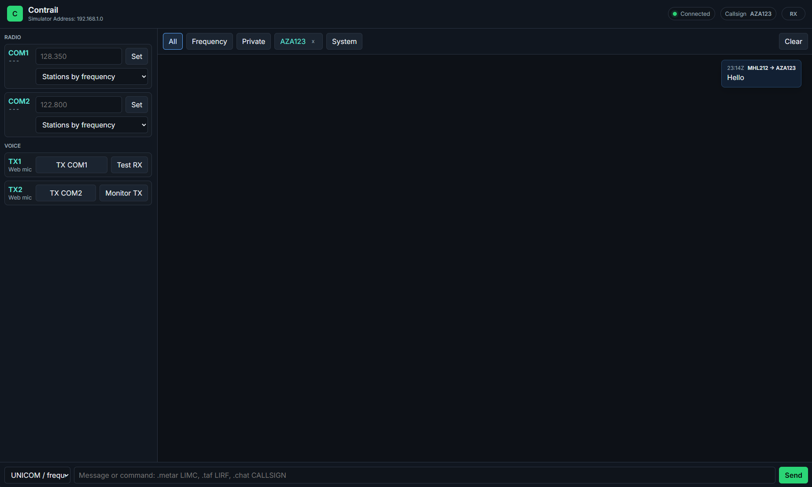
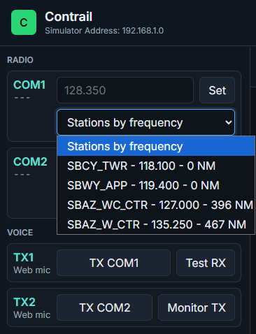

# Contrail

Contrail is a local IVAO Altitude bridge with a browser-based radio and messaging console.

It sits between Altitude PilotUI, PilotCore, the IVAO FSD server, and the TS2 voice server. The webapp lets you manage text messages, tune radios, monitor received voice, and transmit from a browser microphone using COM1 or COM2.

In hosted remote mode, Contrail can also turn a phone or tablet browser into the IVAO microphone for a simulator PC that has no usable microphone, while the IVAO-facing proxy still stays local on that PC.

> Experimental personal-use project. Contrail is not affiliated with, endorsed by, or supported by IVAO. Use responsibly and follow IVAO rules.

Current feature status and roadmap are tracked in [Project Status](docs/PROJECT_STATUS.md).

Release notes are tracked in [CHANGELOG.md](CHANGELOG.md).

GitHub release summary notes for the first public release are in
[Release Notes](docs/RELEASE_NOTES.md).

The technical paper explaining the full architecture and implementation choices
is in [Technical Paper](docs/TECHNICAL_PAPER.md).

The current local, hosted-browser, self-hosted-server, and developer usage paths
are summarized in [Usage Modes](docs/USAGE_MODES.md).

The full documentation index is in [docs](docs/README.md). Remote access and self-hosting design notes are tracked in [Remote Architecture](docs/REMOTE_ARCHITECTURE.md), [Authentication Architecture](docs/AUTH_ARCHITECTURE.md), [Self-Hosting](docs/SELF_HOSTING.md), [Security](SECURITY.md), [Privacy](docs/PRIVACY.md), and [Threat Model](docs/THREAT_MODEL.md).

## What It Does

- Shows IVAO messages in a clean webapp.
- Sends frequency, private, and broadcast text messages.
- Requests METAR, TAF, ATIS, and voice channel joins through the IVAO connection.
- Tunes COM1 and COM2 from the webapp.
- Lists available online stations and lets you tune them with one click.
- Filters observer stations ending in `_OBS`.
- Receives IVAO voice audio in the webapp.
- Transmits browser microphone audio to IVAO voice with `TX COM1` / `TX COM2`.
- Lets a remote phone or tablet browser act as the microphone for the local Altitude session when Remote mode is configured.
- Mirrors TX state into Altitude, so the TX indicator lights while web TX is active.
- Keeps the webapp connected with heartbeat/reconnect handling.
- Keeps raw/debug logs out of the normal UI.

## Screenshot



## Architecture

Current release:

```text
PilotUI
  |
  | 4827 simulator/core protocol
  v
Contrail proxy
  |
  +---> PilotCore
  |
  +---> IVAO FSD proxy on 6809
  |
  +---> TS2 voice proxy on 8767
  |
  +---> Webapp on http://localhost:3000
```

The local proxy is intentionally modular. `proxy.js` is now mostly the bootstrap
that wires these runtime modules together:

| Module | Responsibility |
|---|---|
| `proxy/pilot-bridge.js` | PilotUI/PilotCore bridge on port `4827`, FSD host rewrite, COM state learning, and synthetic PilotUI TX lamp feedback. |
| `proxy/fsd-proxy.js` | IVAO FSD TCP proxy on `127.0.0.1:6809`, parsed chat/weather/ATIS/flight-plan events, and VOICE host rewrite. |
| `proxy/ts2-voice-proxy.js` | TS2 TCP/UDP forwarding on `8767` and RX voice side-tap decoding for the browser. |
| `proxy/web-tx.js` | Browser microphone TX encoding, monitoring, TS2 transmit packet shaping, and TX session caching. |
| `proxy/local-web-server.js` | Local static webapp server, `/ws` control channel, local origin checks, command dispatch, test tone, and browser RX fan-out. |
| `proxy/app-state.js` | UI-visible runtime state: callsign, connection, COMs, XPDR, flight plan, stations, own position, and recent chat history. |
| `proxy/remote-agent.js` | Optional outbound connection from the local proxy to a self-hosted or hosted relay. |
| `proxy/fsd-parser.js`, `proxy/pilot-core.js`, `proxy/socket-utils.js` | Small protocol/helper modules used by the runtime modules above. |

Planned remote/self-hosted mode:

```text
Remote browser / phone
        |
        | HTTPS + WSS
        v
Contrail Relay
        ^
        | WSS outbound from the user's PC
        |
Contrail Agent on the PC with Altitude
        |
        +-- PilotUI / PilotCore
        +-- IVAO FSD
        +-- IVAO TS2 voice
```

Remote Preview is implemented for browser controls, live RX audio forwarding, and preview TX audio routing, while production remote access is still planned. The design goal is that the relay is open source and self-hostable, so users can choose the official relay, a community relay, or their own private relay.

The first shared remote protocol definitions live in [packages/protocol](packages/protocol). They define the versioned message envelope and reject unknown/raw remote command types by default.

The first relay skeleton lives in [apps/relay](apps/relay). It currently provides healthcheck, WebSocket upgrade, origin allowlist, scoped token gate, optional SQLite-backed token auth, optional hosted account registration/login, a minimal token-protected `/admin` panel for SQLite user/device/pairing/audit management, protocol validation, in-memory agent registration, short-lived browser pairing codes for token-mode browsers, persistent hashed browser pairing authorizations, and narrow allowlisted routing between authorized browsers and agents.

Self-host preview files live in [infra/docker](infra/docker). They provide a
Docker Compose setup for the relay and the hosted static webapp behind Caddy
HTTPS/WSS. See [Self-Hosting](docs/SELF_HOSTING.md) for VPS setup steps.

The local proxy can optionally connect outbound as an early remote agent. This
is disabled by default and is still a preview feature, not a complete hosted
remote product.

The webapp also has an early remote-browser preview. A self-hosted Caddy setup
can serve it at:

```text
https://app.example.com/
```

Public HTTPS hosts default to Remote Preview mode. In this preview the browser
can connect to the relay, pair with the online agent using a short-lived code,
tune radios, send chat, request METAR/TAF/ATIS, send XPDR commands, and receive
live RX audio from the local agent. Remote TX preview routing is also present:
the remote browser can send microphone PCM through the relay into the local Web
TX encoder. A SQLite-backed hosted account preview is also present: browsers
can log in with a session cookie, while the local proxy authenticates with a
one-time generated agent token. This is still preview-grade and not a complete
production authorization system.

The current Remote Preview has been verified for pairing, pairing
persistence/revocation, COM1/COM2, station dropdowns, chat, dot commands,
METAR/TAF/ATIS, XPDR squawk, STBY/ALT, IDENT, binary Remote RX audio
forwarding, browser-to-agent Remote TX routing, and live Remote TX intelligibility
with a second listener reporting 5/5 audio.

Remote RX currently forwards live uncompressed PCM. This keeps the preview path
simple and low-latency; live self-hosted relay tests confirmed usable audio on
PC and mobile at the same time, with perceived added latency roughly under 200
ms in early testing. A separate iPhone-over-4G test confirmed the hosted webapp
can work from an external mobile network.
This makes a practical phone-as-microphone workflow possible: Altitude and the
proxy run on the simulator PC, while the user speaks through the remote browser
on a phone or tablet.
Compression can be revisited later if bandwidth or scale becomes a problem.
Remote TX uses the same live PCM transport in the opposite direction and still
depends on the local Web TX readiness state. The remote browser follows the
agent's configured Web TX sample rate, so the microphone stream matches the
local encoder profile.

The remote preview also has a `Settings > Remote` panel. It can save the relay
URL, token, and temporary pairing code in browser storage so repeated tests do
not need the token in the address bar. The same panel includes `Check Remote`,
which validates the relay URL/token shape, calls the relay `/health` endpoint,
and summarizes WebSocket, pairing, and agent status.

Preview pairing flow with manual tokens:

1. Copy `apps/relay/.env.example` to `apps/relay/.env` and change `CONTRAIL_RELAY_TOKEN`.
2. Start the relay with `npm run relay:env`.
3. Start the local proxy with remote agent mode enabled in `config.json`.
4. Copy the pairing code printed by the proxy, or shown in the local webapp chat.
5. Open the hosted/static webapp, for example `https://app.example.com/`.
6. Press `Manual Relay Setup` on the first screen, then enter relay URL, relay token, and pairing code in `Settings > Remote`.
7. Press `Apply Remote`, then `Pair Browser` if the code was not sent during connect.

Hosted account flow:

1. Set the relay to `CONTRAIL_RELAY_AUTH_MODE=sqlite-fallback` or `sqlite`.
2. Set `CONTRAIL_RELAY_ENABLE_REGISTRATION=true` if public self-registration should be allowed.
3. Open the hosted webapp. The first screen shows Login / Register for hosted account mode.
4. Copy the one-time agent token shown by the webapp into the local proxy `config.json` as `remoteRelayToken`.
5. Start or restart the local proxy. The logged-in browser can see and control its own online agent without entering a relay token or pairing code.

If a browser was previously configured for manual token mode, `Settings > Remote > Login / Register` reopens the account screen.

The agent token is still required locally because the proxy needs a secret to prove which account owns that PC. It is shown only when created or rotated; if lost, rotate it from `Settings > Remote` or the admin panel.

On PowerShell systems that block `npm.ps1`, use `npm.cmd run relay:env`.
The relay requires an explicit token and will not print complete tokens in
startup logs.
For self-hosted or manual URL testing, prefer a hex token generated with
`openssl rand -hex 32`; this avoids escaping issues with `+`, `/`, and `=`.
If the pairing code expires, open the local webapp on the Altitude PC and use
`Settings > Remote > Renew Pairing Code`; the proxy does not need to be
restarted. Use `Copy Pairing Code` in the same panel to copy the fresh code.

For a complete step-by-step test, see [Remote Testing](docs/REMOTE_TESTING.md).
For a self-hosted VPS preview with HTTPS/WSS, see
[Self-Hosting](docs/SELF_HOSTING.md).

Pairing codes are temporary. Paired browser authorizations are stored by the
relay as hashed browser ids plus agent ids, so a relay restart does not force
trusted browsers to pair again. Use `Forget Pairing` in `Settings > Remote` to
revoke the current browser's access to the paired agent.

The clean webapp URL stays local and loopback-only by default:

```text
http://localhost:3000/
```

Remote preview is activated only explicitly, for example with `?remote=1` or a
relay URL in the query string. The intended model is one local agent per user
and multiple browser devices controlling that same agent.

## How It Works

Contrail runs locally on the same PC as IVAO Altitude. In PilotUI, the simulator address is set to the local IP printed by Contrail. This makes PilotUI connect to Contrail first instead of talking directly to PilotCore.

Contrail then forwards the normal simulator/core traffic to PilotCore, while watching the data passing through. When PilotCore receives the IVAO FSD server address, Contrail rewrites it to `127.0.0.1` so the FSD connection also passes through Contrail.

Through the FSD connection, Contrail can read text messages, METAR/TAF replies, online ATC position data, COM updates, and voice-channel announcements. When IVAO announces a TS2 voice server, Contrail rewrites that server address to the local network IP so TS2 voice packets also pass through the local proxy.

The webapp talks only to Contrail through WebSocket. It does not talk directly to IVAO. Contrail uses the traffic it sees to update the webapp, decode RX voice through ffmpeg, and send browser microphone audio back through the cached TS2 transmit session.

## Requirements

- Windows 10/11 is the currently tested target.
- Node.js 20 or newer.
- IVAO Altitude installed.
- `ffmpeg` available in PATH.
- PilotUI configured to use the simulator address shown by Contrail.
- Browser microphone permission for web TX.

## Install

### Install Node.js

Recommended on Windows:

```powershell
winget install OpenJS.NodeJS.LTS
```

Alternative manual install:

1. Download the LTS installer from <https://nodejs.org/en/download>.
2. Run the installer and keep npm enabled.
3. Close and reopen PowerShell or Command Prompt.

Verify:

```powershell
node -v
npm -v
```

### Install ffmpeg

Recommended on Windows:

```powershell
winget install Gyan.FFmpeg
```

Alternative manual install:

1. Go to <https://ffmpeg.org/download.html>.
2. Open one of the Windows build links, for example gyan.dev.
3. Download a Windows build.
4. Extract it somewhere stable, for example `C:\ffmpeg`.
5. Add the `bin` folder to the Windows `PATH`, for example `C:\ffmpeg\bin`.
6. Close and reopen PowerShell or Command Prompt.

Verify:

```powershell
ffmpeg -version
```

Contrail calls `ffmpeg` as an external executable. If `ffmpeg -version` works from the terminal where you start Contrail, the proxy can use it too.

### Install Project Dependencies

Open a terminal in the Contrail folder and install the Node dependency:

```bash
npm install
```

On Windows PowerShell, if `npm.ps1` is blocked by execution policy, use:

```powershell
npm.cmd install
```

If `config.json` does not exist yet, copy the example config:

```powershell
Copy-Item config.example.json config.json
```

## Start

Use:

```bash
node proxy.js
```

or double-click:

```text
start.bat
```

Then open:

```text
http://localhost:3000
```

## Simulator Address

Contrail automatically chooses the local IPv4 address to use in Altitude. This can be an Ethernet or Wi-Fi address. It ignores loopback and link-local addresses, prefers common home-network ranges, and avoids obvious virtual adapters when possible.

The chosen address is printed in the console and shown in the webapp header. If more than one local address is found, Contrail also prints the detected candidates:

```text
In PilotUI -> Simulator Address: <detected-ip>
```

Put that IP in Altitude PilotUI as `Simulator Address`.

If automatic detection picks the wrong interface, set `lanIp` manually in `config.json`:

```json
{
  "lanIp": "192.168.1.9"
}
```

Leave it empty for automatic detection:

```json
{
  "lanIp": ""
}
```

## Normal Startup Order

1. Close Altitude/PilotCore if they are already running.
2. Start Contrail.
3. Open the webapp at `http://localhost:3000`.
4. Start IVAO Altitude/PilotCore.
5. In PilotUI, set Simulator Address to the IP shown by Contrail.
6. Connect to IVAO normally.
7. Use the webapp for messages, radio tuning, RX, and TX.

## Webapp Overview

### Header

- Connection state.
- Flight plan state. Repeated `FSD_FPL_ERROR` messages are shown as `No flight plan` instead of filling the chat, while direct FSD flight-plan lines and IVAO flight-plan replies switch the pill to `Flight plan`.
- Callsign.
- Simulator address.
- Automatic heartbeat/reconnect state for the web control channel.

### Radio Panel

- Current COM1 and COM2 frequencies.
- COM frequencies are restored from the proxy when the webapp reloads.
- Startup COM state is learned from both binary radio commands and framed PilotCore/PilotUI status payloads.
- Manual COM entry auto-inserts the decimal point after the third digit and tunes when the six digits are complete.
- `TX COM1` and `TX COM2` live inside their matching COM cards.
- COM station dropdown selections are restored from the proxy when station data is known.
- Web TX readiness is shown under the COM cards and pulses slowly while waiting for a voice-channel session.
- `RX` indicator for received voice audio.
- The real-PTT reminder is temporary, while monitor/PTT-release feedback stays out of chat.

### Settings

The topbar `Settings` button opens a modal with:

- `Audio`: microphone state, browser audio output state, Web TX readiness, TX sample rate, `Monitor TX`, and `Test RX`.
- `Connection`: proxy, Altitude/FSD, simulator address, callsign, flight plan, voice server, and heartbeat.
- `About`: version, local/unofficial mode, documentation files, and privacy note.

### Transponder Panel

- Four-digit squawk entry.
- `STBY` / `ALT` mode switch.
- `ID` button for IDENT. The button stays red for 5 seconds after it is pressed.
- The last squawk and `STBY` / `ALT` selection are restored after a webapp refresh.
- Changes made from the aircraft or PilotUI are learned from outgoing IVAO/FSD position updates and reflected in the webapp after the next position packet.

The direct PilotCore command available to Contrail for `STBY` / `ALT` is still a mode toggle. FSD position feedback is used to correct the visible state when PilotCore announces the real mode.

### Stations

Contrail detects online ATC stations and available frequencies from network traffic. COM1 and COM2 each have a station dropdown sorted by distance when aircraft coordinates are available. The proxy keeps a small station snapshot so dropdowns can be rebuilt after a webapp reload.

`UNICOM - 122.800` is always available in both COM dropdowns and can be selected like any other station.

Observer stations ending in `_OBS` are hidden.



### Message Views

- `All`
- `Frequency`
- `Private`
- One tab per private conversation.
- `System`

There is no raw log view in the normal UI.

## Voice

### Receive

When Altitude receives TS2 voice packets, Contrail decodes them through ffmpeg and streams PCM audio to the browser.

The `RX` indicator lights for received audio. `Monitor TX` plays your encoded microphone audio locally without transmitting to IVAO.

UNICOM can be tuned from the radio dropdown. Voice reception on UNICOM depends on whether Altitude/IVAO actually provides nearby TS2 voice packets for that frequency; Contrail cannot force a UNICOM voice channel if the network does not announce or send one.

### Transmit

Use `TX COM1` or `TX COM2`.

For TX to work after a fresh proxy restart, Contrail must know the TS2 transmit session. It now tries to derive that session from TS2 voice-channel join/setup traffic. If Web TX still does not become ready after joining a voice-capable station, press the real Altitude PTT once as a fallback.

Once the session is cached:

1. Hold `TX COM1` or `TX COM2`.
2. Speak into the browser microphone.
3. Release the button.

Altitude should show TX while the button is held.

## Commands

Type commands in the message box.

When the message starts with `.`, Contrail shows command suggestions. Use `Tab` to complete the selected command, arrow keys to move through suggestions, and `Esc` to close the list.

| Command | Description |
|---|---|
| `.metar ICAO` | Request METAR |
| `.wx ICAO` | Alias for `.metar` |
| `.taf ICAO` | Request TAF |
| `.atis CALLSIGN` | Request ATIS |
| `.msg CALLSIGN text` | Send private message |
| `.m CALLSIGN text` | Alias for `.msg` |
| `.chat CALLSIGN` | Open a private chat tab |
| `.chat CALLSIGN text` | Open a private chat tab and send text |
| `.c1 122.800` | Tune COM1 |
| `.c2 119.100` | Tune COM2 |
| `.x 2000` | Set squawk |
| `.xpdr` / `.xp` | Toggle transponder |
| `.ident` / `.id` | Send IDENT |

Developer voice notes are documented separately in [Developer Tools](docs/DEVELOPER_TOOLS.md).

## Configuration

Main config lives in `config.json`. Use `config.example.json` as the template. Personal `config.json` is ignored by git.

Contrail validates known config fields at startup. Invalid values are replaced with safe defaults and reported in the console with a `[CONFIG]` warning.

Useful voice fields:

```json
{
  "voiceDecode": true,
  "voiceDiagnostics": false,
  "voiceSampleRate": 32000,
  "voiceStripBytes": 1,
  "voiceFramesPerPacket": 12,
  "webTxEnabled": true,
  "webTxSampleRate": 8000,
  "webTxQuality": 10,
  "webTxFramesPerPacket": 5,
  "webTxPacketIntervalMs": 92,
  "webTxPacketMode": "fixed"
}
```

Set `"voiceDiagnostics": true` only while troubleshooting voice. It enables
compact `[VOICE RX]`, `[REMOTE TX]`, and `[WEBTX]` counters that show whether
RX packets are decoded and whether TX PCM becomes TS2 voice packets.

Early remote-agent fields:

```json
{
  "remoteAgentEnabled": false,
  "remoteRelayUrl": "ws://127.0.0.1:8787",
  "remoteRelayToken": "change-me",
  "remoteDeviceId": "",
  "remoteDeviceName": "",
  "remoteReconnectMs": 5000
}
```

Remote agent mode is experimental and disabled by default. When enabled, the
local proxy opens an outbound WebSocket to the relay. It does not expose the
local PilotUI/PilotCore, FSD, or TS2 ports to the internet.

## Known Limitations

- Web TX needs a cached or derived TS2 transmit session after a proxy restart. Contrail now attempts to derive it from voice-channel join/setup traffic; pressing the real Altitude PTT once remains the fallback if a live server/session variant is not recognized.
- Web TX may have a slight crackle compared with native Altitude TX, although remote users can understand it.
- IVAO does not echo the user's own TX audio, so final TX confirmation requires another listener.
- Message history is intentionally in memory. Recent messages survive a webapp refresh while the proxy keeps running, but not a full proxy restart.
- The webapp can be served locally by the proxy or statically by the self-host preview stack.
- Complete production remote access from outside the local network is planned; the current self-host relay is still a private preview foundation.
- Remote Preview is verified for controls, RX audio on PC and mobile at the
  same time, browser-to-agent TX audio routing, and live IVAO Remote TX with a
  listener reporting successful reception. It includes browser pairing
  persistence, hosted SQLite account login/registration preview, session-cookie
  browser authentication, SQLite admin-side pairing revocation, and a minimal
  SQLite audit log for security/control events, but broader live audio
  validation and production hardening are not complete yet.
- The proxy is designed to run locally. It is not hardened for exposure to the public internet.
- ffmpeg must currently be installed on the PC and available to the Node process.
- Full Altitude/IVAO integration tests are not yet present. Local verification
  is available with `npm run verify`, and the relay/agent/browser Remote
  Preview simulation is available with `npm run remote:test`.

## Troubleshooting

### `ffmpeg` Not Found

Run:

```powershell
ffmpeg -version
```

If the command is not found, install FFmpeg and reopen the terminal before starting Contrail.

### Port Already In Use

Contrail uses these local ports:

- `3000` for the webapp.
- `4827` for PilotUI/PilotCore traffic.
- `6809` for IVAO FSD traffic.
- `8767` for TS2 voice traffic.

If startup reports `EADDRINUSE`, another Contrail instance or another program is already using that port. Close the other process and start Contrail again.

If startup reports that `4827` cannot listen because of `EADDRINUSE` or `EACCES`, PilotCore probably took the simulator/core port before Contrail. Close Altitude/PilotCore, start Contrail first, then start Altitude again.

### Altitude Does Not Connect

- Start Contrail before connecting Altitude.
- Check the simulator address printed by Contrail.
- Put that exact IP in PilotUI as `Simulator Address`.
- If the detected IP is wrong, set `lanIp` in `config.json`.

### RX Audio Does Not Play

- Make sure the webapp is open and connected.
- Press `Test RX` to confirm browser audio output.
- Confirm `ffmpeg -version` works in the same terminal used to start Contrail.

### Webapp Looks Stale After Standby

The webapp automatically checks the control channel with heartbeat `ping` / `pong` messages and reconnects stale sockets without refreshing the page.

### Web TX Is Not Ready

After a fresh proxy restart, join a voice-capable station and wait for Web TX to show ready. If it does not become ready, press the real Altitude PTT once as a fallback, then use `TX COM1` or `TX COM2` from the webapp.

### Web TX Is Distorted

- Use `Monitor TX` to check the browser microphone locally.
- Keep microphone gain reasonable and avoid clipping.
- Leave the working TX values from `config.example.json` unless testing a new voice profile.

## Security And Privacy

Contrail is designed to run locally. Do not expose the proxy ports directly to the internet.

The webapp is a local control surface. It talks to the local proxy over WebSocket and does not connect directly to IVAO. The proxy observes and forwards the local Altitude traffic needed for radio, chat, weather requests, and voice.

Contrail does not store IVAO credentials. Message history is currently kept in memory and is cleared when the proxy exits.

## Developer Tools

Current voice profiles and monitor notes are documented in [Developer Tools](docs/DEVELOPER_TOOLS.md).

Run the local verification self-test with:

```bash
npm run verify
```

On Windows PowerShell, if `npm.ps1` is blocked by execution policy, use:

```powershell
npm.cmd run verify
```

This command checks required project files, JSON files, local proxy modules,
relay scripts, the protocol package, webapp asset references, and browser/admin
JavaScript syntax. It does not check GitHub for newer versions, download
updates, start Altitude, or test live IVAO voice.

`npm run check` is kept as an alias for the same local verification command.

Run the automated Remote Preview relay simulation with:

```bash
npm run remote:test
```

On Windows PowerShell:

```powershell
npm.cmd run remote:test
```

This starts a temporary localhost relay, simulates one agent and one browser,
checks health/CORS, verifies that commands are blocked before pairing, verifies
pairing and allowlisted routing, verifies Remote RX binary forwarding, verifies
Remote TX binary forwarding, then verifies browser-side revocation. It does not
start Altitude or connect to IVAO.

GitHub Actions runs `npm run verify` and `npm run remote:test` automatically on
Windows and Linux for pushes and pull requests to `main` or `master`.

## Third-Party Notices

Runtime dependencies and external tools are documented in [Third-Party Notices](docs/THIRD_PARTY_NOTICES.md).

## License

Contrail is released under the [MIT License](LICENSE).
