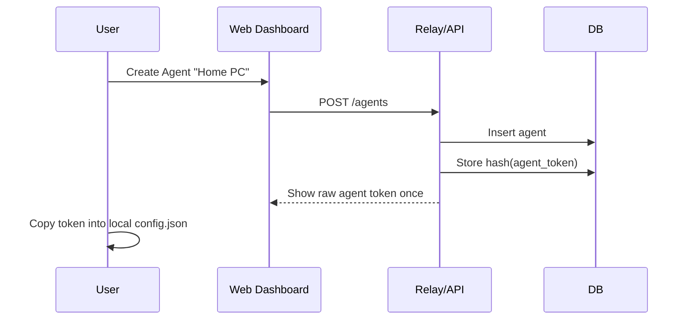
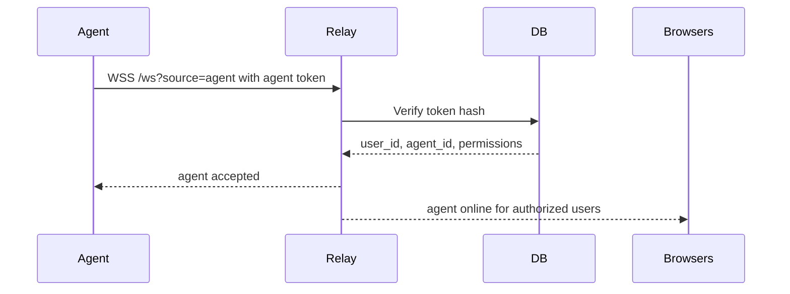
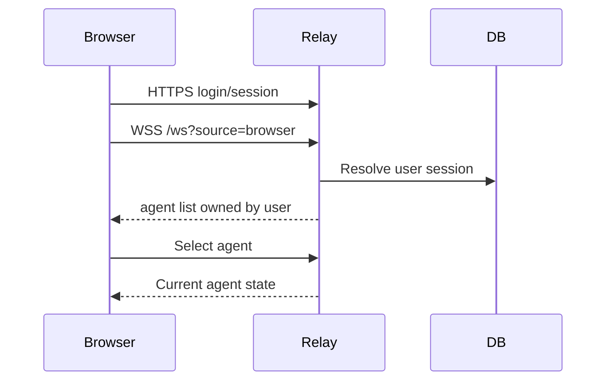
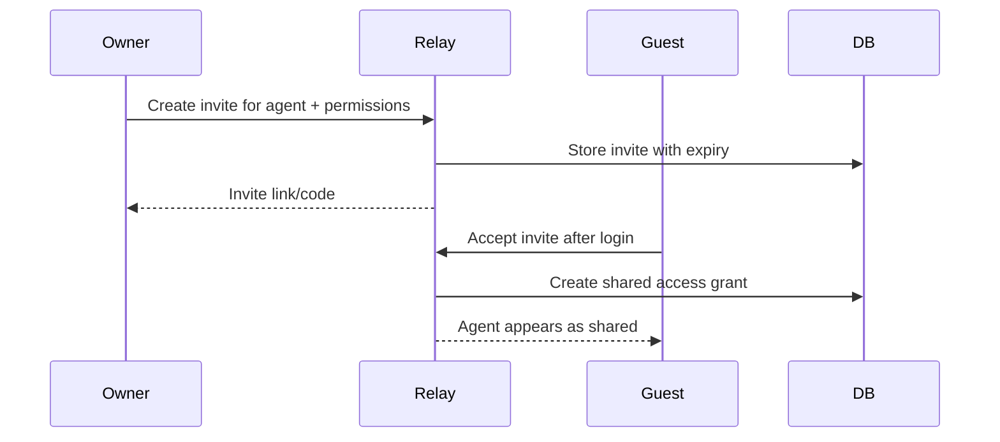

# Contrail Authentication And Multi-User Architecture

Status: design proposal  
Scope: future production remote mode and Shared Cockpit mode

Current implementation note: the active multi-user work is limited to isolated
users on the same relay. Shared Cockpit, guest permissions, roles, and TX locks
are intentionally out of scope for now and should be treated as far-future
design material.

The first concrete database draft for users, agent tokens, browser pairings,
sessions, and audit events is tracked separately in
[Database Design](DATABASE_DESIGN.md).

## Summary

The current Remote Preview uses one relay token from environment variables plus
short-lived browser pairing codes. That is acceptable for a private self-hosted
preview, but it is not the right model for multiple users.

In a multi-user deployment, users should not manually insert their own tokens
into the server. The server should create and register tokens itself, store only
hashed token material, and expose user/device management through an authenticated
dashboard.

The production model should be:

```text
User account
  owns one or more local agents
  owns one or more browser sessions/devices
  can invite trusted guests to a Shared Cockpit session

Local agent
  authenticates with an agent token generated by the server
  connects outbound to the relay over WSS
  remains the only component that talks to Altitude, FSD, and TS2

Browser
  authenticates with the user's web session
  can control only agents owned by the user or explicitly shared with the user
```

## Goals

- Replace the single preview relay token with per-user and per-agent identity.
- Keep the local proxy off the public internet.
- Let each user self-host independently or use a hosted relay.
- Avoid sharing agent tokens with guests.
- Support multiple browsers for the same user.
- Support Shared Cockpit without giving guests ownership of the IVAO-connected
  agent.
- Make all access revocable.
- Keep remote commands typed, allowlisted, and auditable.

## Non-Goals

- Do not store IVAO credentials.
- Do not expose PilotUI, PilotCore, FSD, or TS2 ports directly to the internet.
- Do not create a raw remote tunnel.
- Do not store voice audio or chat history on the relay by default.
- Do not let a Shared Cockpit guest silently take TX or radio control.

## Identity Model

### User

A user is the account holder. In the normal case, this is the pilot who owns the
PC running Altitude and Contrail.

Users authenticate to the webapp with normal web authentication:

- Email/password plus MFA, or
- OAuth provider, or
- Passkeys/WebAuthn.

Passkeys are the preferred long-term option because they reduce password and
phishing risk.

### Agent

An agent is one local Contrail proxy running on one PC.

The server generates an agent token when the user creates an agent in the
dashboard. The token is shown once and copied into the local `config.json`.

The server stores only a hash of the token. When the local proxy connects, the
relay verifies the token and binds the WebSocket to:

```text
user_id
agent_id
agent_name
```

### Browser Device

A browser device is a webapp session or browser installation authorized for a
user account.

In production, browser identity should come from the user's web session and an
optional device record. The current preview browser id can remain useful as a
device fingerprint for friendly names and revocation, but it should not replace
real account authentication.

### Guest

A guest is another authenticated user who has been granted temporary or
persistent access to a specific agent through Shared Cockpit.

Guests never receive the agent token. They receive permissions through the
server authorization model.

## Token Types

### Relay Bootstrap Token

Current preview:

```env
CONTRAIL_RELAY_TOKEN=shared-preview-token
```

This is a private preview gate. It should remain only for single-user
self-hosting or development.

Production:

- Remove the global shared token from browser access.
- Keep optional deployment-level secrets only for server-to-server operations.
- Do not use one token for all users.
- Production mode must refuse to start with only the global preview token.
- The preview token path should be enabled only when an explicit
  `CONTRAIL_PREVIEW_MODE=true`-style setting is present.
- Once database-backed production auth exists, the preview token should have a
  documented deprecation window and should not remain as an accidental fallback.

### Agent Token

Agent tokens authenticate local agents.

Recommended properties:

- Generated by the server.
- Long random value, at least 32 bytes.
- Displayed once.
- Stored hashed server-side.
- Revocable.
- Rotatable.
- Scoped to one agent.
- Never shared with guests.

Recovery and rotation:

- If the user loses the raw token before copying it into `config.json`, the UI
  should create a new token and revoke or mark the unused old token as
  superseded.
- The server must never display an existing token again.
- A safe rotation flow should allow creating a new token while the old token
  remains valid temporarily.
- Recommended rotation: create new token, update local `config.json`, confirm
  the agent reconnects with the new token, then revoke the old token.
- The optional grace period should be explicit and short, for example 10-30
  minutes, and visible in the dashboard.

Example user flow:

```text
Dashboard -> Create Agent -> Server generates token
User copies token into config.json
Proxy connects with token
Relay verifies token hash
Agent appears online in user's dashboard
```

### Browser Session Token

Browser sessions authenticate web users.

Recommended properties:

- Short-lived access token or secure HTTP-only session cookie.
- Refresh-token rotation if using token-based auth.
- CSRF protection if cookies are used.
- MFA/passkey support.

### Pairing Code

Pairing codes remain useful, but their job changes.

Current preview:

- Pairing code binds a browser id to an online agent.

Production:

- Pairing code can be used to link a local agent to an authenticated user or to
  confirm a browser/device.
- It should be short-lived and one-time.
- It should not replace account login.

## Main Flows

### 1. User Creates An Agent



Important details:

- The raw token is not stored.
- The UI must warn that the token is shown once.
- Token rotation should create a new token and invalidate the old one.

### 2. Local Agent Connects



The relay should bind this socket to exactly one `agent_id`. If the same agent
connects twice, the server should either reject the second connection or replace
the older socket in a controlled way.

### 3. Owner Browser Connects



The browser never needs the agent token.

### 4. Shared Cockpit Invite



An invite should include:

- Target agent.
- Guest user or invite code.
- Permission set.
- Expiry.
- Optional maximum session duration.
- Owner-visible status.

## Permission Model

Permissions should be hierarchical in the product UI and atomic in the
authorization layer.

The recommended model has three layers:

1. **Atomic capabilities** used by the relay authorization code.
2. **Role templates** shipped by Contrail for common cases.
3. **Custom roles and per-guest overrides** controlled by the owner.

This keeps the common UI simple while still letting an owner grant unusual
combinations such as "TX only on COM2" or "listen only, no chat".

### Atomic Capabilities

Suggested initial capabilities:

```text
view_status
read_chat
send_chat
rx_audio
tx_com1
tx_com2
tune_com1
tune_com2
set_xpdr_code
set_xpdr_mode
ident
request_weather
request_atis
manage_invites
manage_agent
force_release_tx
```

`tx_com1` and `tx_com2` are intentionally separate. A single `tx_audio`
permission is too broad for Shared Cockpit because the owner may want to let a
guest transmit only on one radio.

### Role Templates

Role templates are defaults, not hard-coded limits. Owners should be able to
create custom roles or override permissions for a specific guest.

#### Owner

Full control over their own agent. This is not a shareable role.

#### Trusted Crew

Useful Shared Cockpit template:

```text
view_status
read_chat
send_chat
rx_audio
tx_com1
tx_com2
tune_com1
tune_com2
request_weather
request_atis
```

XPDR and IDENT should be opt-in because they affect the connected pilot's
network state.

#### Observer

Read-only template:

```text
view_status
read_chat
rx_audio
```

No TX, tuning, chat send, or XPDR control.

#### Radio Operator

Focused crew template:

```text
view_status
read_chat
send_chat
rx_audio
tx_com1
tx_com2
tune_com1
tune_com2
request_weather
request_atis
```

This role is similar to Trusted Crew but should still be visually distinct in
the UI so the owner knows another person can transmit.

### Customization

The owner should be able to:

- Create named custom roles from templates.
- Add or remove atomic capabilities from a role.
- Override capabilities for a single guest without creating a new role.
- Restrict grants by expiry time and optionally by COM.
- Revoke a role or guest grant immediately.

The relay should authorize against the final resolved capability set:

```text
owner capability
  OR custom role capability
  OR grant-specific override capability
```

## TX Safety In Shared Cockpit

Shared TX is the most sensitive part of the design.

Required controls:

- Only one browser may hold TX at a time per agent.
- The owner must see who is holding TX.
- The owner must have an immediate "force release TX" action.
- The relay must stop TX on browser disconnect.
- The agent must stop TX on relay disconnect.
- Maximum TX duration must apply to every user.
- Guests need explicit `tx_com1` and/or `tx_com2` permission.
- TX control should have a visible active-user label.
- Optional owner approval before first guest TX in a session.

Suggested state:

```text
agent_tx_lock
  agent_id
  holder_user_id
  holder_browser_session_id
  com
  started_at
  expires_at
```

The lock scope is `agent_id`. The holder identity is the specific browser
session, not only the user. If the same user opens two tabs or uses a phone and
desktop at the same time, only one browser session can hold TX. The other
session receives a typed `tx-lock-busy` style error.

Lock acquisition must be atomic. Otherwise two browsers can send `tx.start`
nearly simultaneously and both believe they own TX.

Acceptable implementations:

- Redis: `SET tx_lock:<agent_id> <lock-value> NX PX <duration>`.
- PostgreSQL: transaction plus row lock, for example `SELECT ... FOR UPDATE`,
  or a table design where a unique active lock can exist per `agent_id`.
- SQLite: transaction with an immediate write lock and a unique active lock
  invariant.
- Single-process preview relay: in-memory map is acceptable only while the
  relay runs as one process.

If the relay is deployed with multiple instances, in-memory TX locks are not
safe. Use Redis or a database-backed lock.

The owner force-release action must delete the lock atomically and send a
`tx.stop` to the agent. If the original holder later sends `tx.stop`, the relay
should treat it as idempotent.

## Database Model

This is a minimal production-oriented schema. Exact implementation can vary.

```text
users
  id
  email
  display_name
  created_at
  disabled_at

auth_identities
  id
  user_id
  provider
  provider_subject
  created_at

agents
  id
  owner_user_id
  name
  device_id
  created_at
  revoked_at
  last_seen_at

agent_tokens
  id
  agent_id
  token_hash
  created_at
  last_used_at
  revoked_at

browser_devices
  id
  user_id
  browser_id_hash
  name
  created_at
  last_seen_at
  revoked_at

pairing_codes
  id
  agent_id
  code_hash
  expires_at
  consumed_at

shared_access_grants
  id
  agent_id
  owner_user_id
  guest_user_id
  role
  expires_at
  revoked_at
  created_at

shared_access_grant_permissions
  grant_id
  permission
  effect

shared_invites
  id
  agent_id
  owner_user_id
  invite_hash
  expires_at
  accepted_by_user_id
  accepted_at
  revoked_at

shared_invite_permissions
  invite_id
  permission
  effect

custom_roles
  id
  owner_user_id
  name
  created_at
  revoked_at

custom_role_permissions
  role_id
  permission
  effect

audit_events
  id
  actor_user_id
  target_user_id
  target_agent_id
  browser_device_id
  event_type
  command_type
  ip_address
  user_agent
  result
  metadata_json
  created_at
```

`permissions_json` should not be the primary permission store. It is hard to
query, migrate, and audit. A normalized permission table is more verbose, but it
answers practical questions such as "who can transmit on COM1?" or "which
guests can tune COM2?".

`metadata_json` is acceptable for optional event details, but audit events need
queryable columns for the fields that will be searched during support or
incident review: actor, target, agent, command, IP address, user agent, result,
and timestamp.

JSON blobs are still useful for non-authoritative metadata, for example a
human-readable user agent summary or UI label. They should not be the source of
truth for permission checks or audit dimensions that need filtering.

## Authorization Rules

Every browser command should pass these checks:

1. Browser session is valid.
2. Target agent exists.
3. Agent is online if the command requires live routing.
4. User owns the agent or has a non-expired shared grant.
5. User has the specific permission for the requested command.
6. Command payload validates against the shared protocol.
7. Rate limit allows the action.
8. TX lock rules allow the action if it is audio TX.

Every agent connection should pass these checks:

1. Agent token is valid.
2. Token is not revoked.
3. Agent is not revoked.
4. Token belongs to exactly one agent.
5. Agent connection is bound to that agent id.

## Offline And Degraded Behavior

Remote access must be optional. If the relay is unreachable, slow, restarting,
or misconfigured, the local agent must continue to work in local mode.

Required behavior:

- PilotUI/PilotCore proxying continues.
- FSD proxying continues.
- TS2 RX/TX local voice continues.
- Local browser webapp continues at `http://localhost:3000`.
- Local Web TX continues if its normal prerequisites are satisfied.
- The agent retries the relay connection in the background.
- Remote browsers show a relay/agent unavailable state instead of affecting the
  local session.
- Any remote-held TX lock is released when the agent disconnects from the relay.

The remote relay must never become a dependency for flying locally. This is
especially important during live IVAO sessions.

## API Sketch

Possible REST endpoints:

```text
POST /auth/login
POST /auth/logout
GET  /me

GET  /agents
POST /agents
POST /agents/:id/tokens
POST /agents/:id/tokens/:tokenId/revoke
POST /agents/:id/revoke

GET  /agents/:id/shares
POST /agents/:id/invites
POST /invites/:code/accept
POST /shares/:id/revoke

GET  /devices
POST /devices/:id/revoke

GET  /audit
```

WebSocket identity:

```text
Agent:
  WSS /ws?source=agent
  Authorization: Bearer <agent_token>

Browser:
  WSS /ws?source=browser
  Cookie or Authorization header from web login
```

For browser WebSockets, cookie-based auth is convenient when the webapp and
relay/API share the same parent domain. If cross-domain hosting is needed,
short-lived bearer tokens may be simpler.

## Self-Hosted Mode

Self-hosting should support two modes:

### Private Preview Mode

Current mode:

- One global relay token.
- Pairing codes.
- Persisted browser pairings. `env` mode uses a JSON file; SQLite modes use
  the relay database and admin-side revocation.
- Suitable for a trusted single-user VPS.

### Production Self-Hosted Mode

Future mode:

- Local database.
- User accounts.
- Agent tokens.
- Browser sessions.
- Shared cockpit grants.
- Audit events.
- Admin UI.

The repository should make both modes explicit so users do not mistake private
preview security for production multi-user security.

## Database Choice

SQLite and PostgreSQL serve different deployment shapes and should both be
considered first-class targets if the project wants serious self-hosting.

Recommended split:

- **SQLite** for private, single-user, or small trusted self-hosting.
- **PostgreSQL** for community relays, official hosted relay, and real
  multi-user deployments.

This choice should influence the data-access layer from the beginning. Avoid
PostgreSQL-only assumptions in core authorization logic unless the feature
explicitly requires multi-instance semantics. For TX locks in multi-instance
deployments, PostgreSQL transactions or Redis are appropriate; for small
single-process SQLite deployments, a transaction-backed lock can be sufficient.

## Migration From Current Preview

Suggested migration path:

1. Keep the current global token only for private preview and development.
2. Add a runtime flag that clearly separates preview auth from production auth.
3. Add database-backed users and agents.
4. Add server-generated agent tokens.
5. Temporarily allow the local proxy to authenticate as either preview-token or
   agent-token only when preview mode is explicitly enabled.
6. Add browser login.
7. Route browser commands by account-owned or shared agent instead of preview
   browser id.
8. Add persistent browser sessions.
9. Add Shared Cockpit grants.
10. Disable global preview token by default in production deployments.
11. Remove the preview-token production fallback after a documented deprecation
    window.

The dual-auth period should be treated as migration debt. It should have an
explicit removal target, because leaving both paths available increases attack
surface and makes production behavior harder to reason about.

## Security Requirements

- Store only token hashes, never raw agent tokens.
- Use constant-time token hash comparison where practical.
- Use HTTPS/WSS only for remote mode.
- Keep strict Origin checks.
- Keep protocol message validation.
- Keep command rate limits and audio frame-size validation.
- Keep agent-side command rate limits.
- Do not log tokens, pairing codes after creation, chat contents, raw packets,
  or audio payloads.
- Make all grants revocable.
- Make revocation effective immediately for active WebSockets.
- Add audit logs for login, agent token creation, token use, revocation,
  invite creation, invite acceptance, and permission failures.
- Keep audit fields queryable for operational questions such as failed logins by
  IP address, guest TX usage by week, and commands sent to a specific agent.

## Privacy Requirements

- Do not store voice audio.
- Do not store chat history by default.
- Let users delete browser devices and shared grants.
- Document what metadata the relay stores: user id, agent id, device id,
  command type, result, timestamps, IP-derived security logs if enabled, and
  audit events.
- Make self-hosting clear for users who do not want official hosted relay
  infrastructure.

## Open Questions

- Which login method should be implemented first: email/password, OAuth, or
  passkeys?
- Should Shared Cockpit invites be account-targeted, link/code-based, or both?
- Should guest TX require owner approval each session?
- How should mobile UI expose shared cockpit active-user state?
- Should TX locks use Redis for all production deployments, or should
  PostgreSQL locks be enough for the first hosted version?

## Recommended Implementation Order

1. Add an agent-scoped TX lock and owner force-release in the current preview
   relay. This reduces the riskiest Shared Cockpit failure mode before the full
   auth system exists.
2. Split remote TX permissions into COM-specific capabilities in the protocol
   and relay authorization model.
3. Add a preview-friendly permission resolver that can later read from the
   database.
4. Add the database layer and migration tooling with SQLite and PostgreSQL
   targets in mind.
5. Add agent records and server-generated agent tokens.
6. Move pairing/device persistence from file to database for SQLite modes.
   This is implemented for preview browser pairings; production browser
   sessions and audit events remain future work.
7. Update the relay to authenticate agents by agent token.
8. Add user accounts and browser login.
9. Update the browser to list account-owned or shared agents.
10. Expand structured audit events beyond the current minimal SQLite control
    log.
11. Add Shared Cockpit grants without TX first.
12. Add Shared Cockpit TX using the already-tested lock and force-release path.
13. Harden deployment defaults for production self-hosting.
